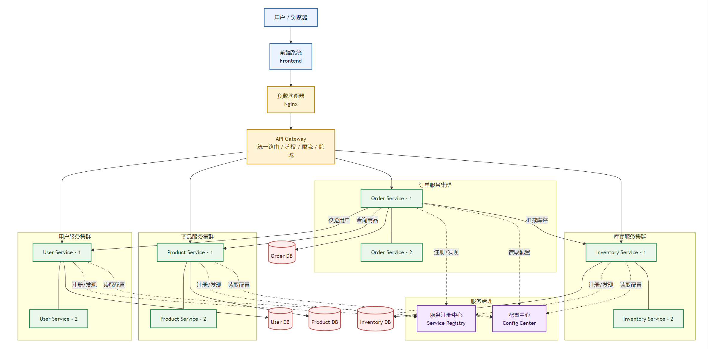
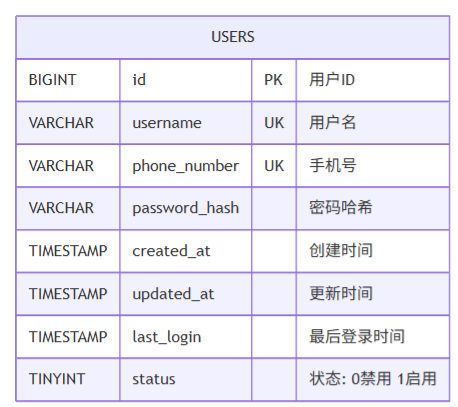
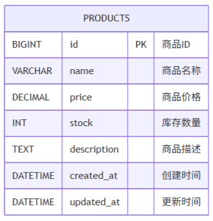
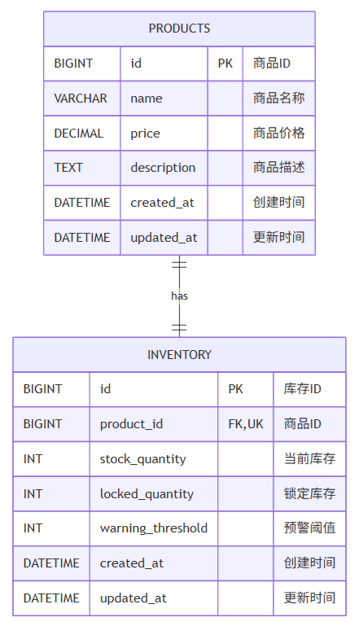
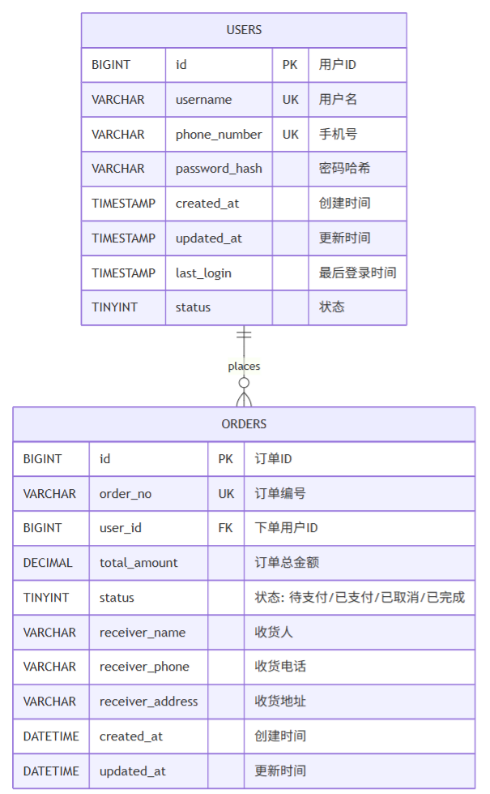
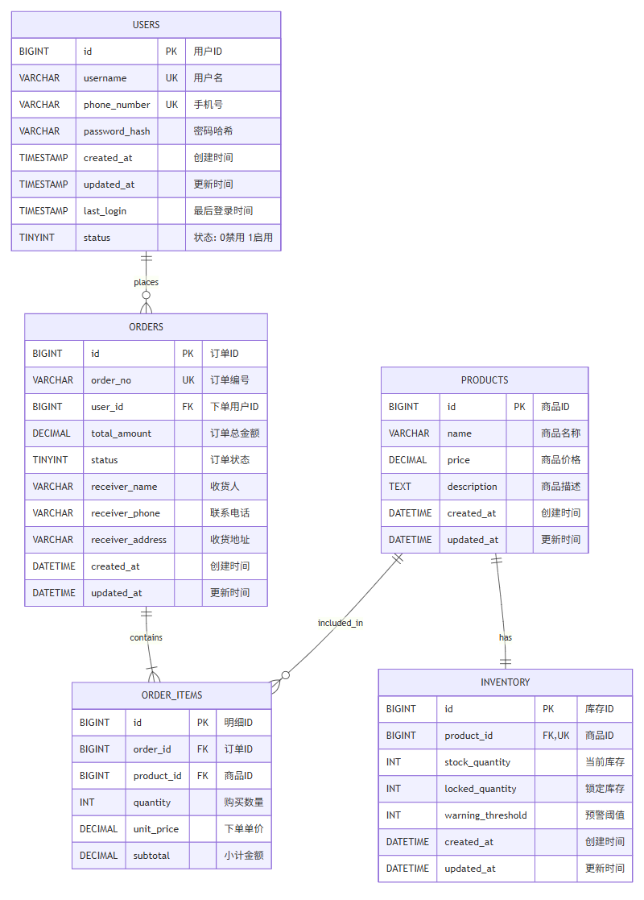
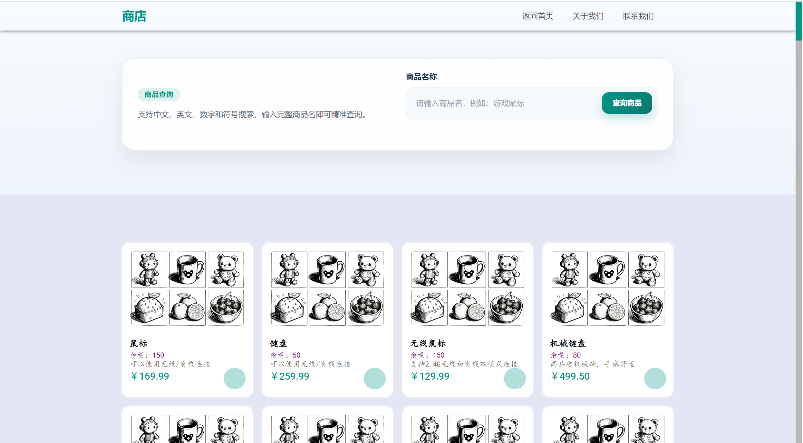
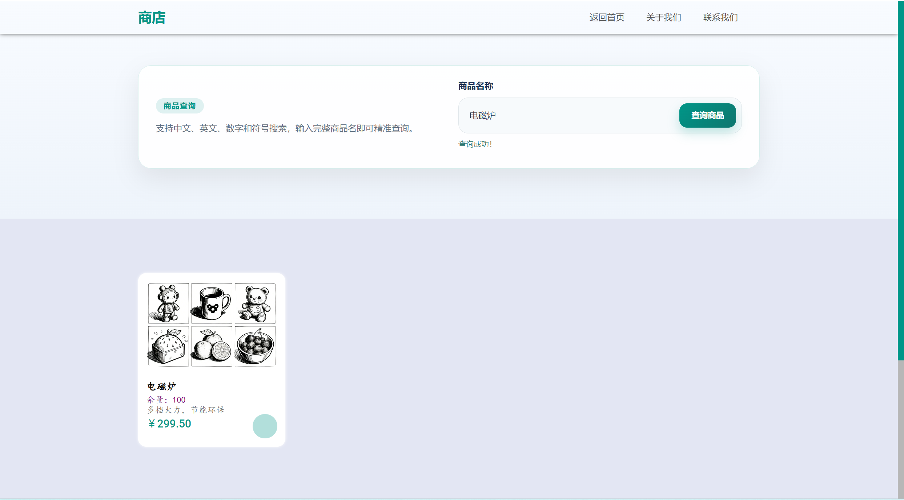
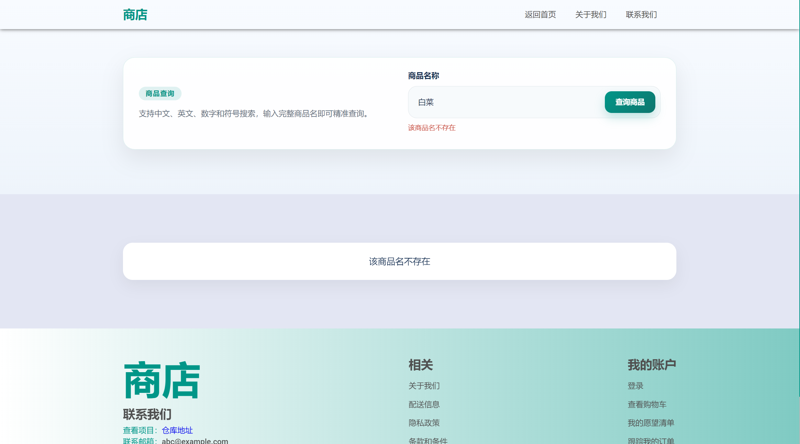

# 第一次作业

## 一、系统设计文档

本节围绕系统的整体方案展开说明，重点展示分布式服务拆分思路、核心API设计、数据库模型以及技术栈选型，便于从“架构设计”和“实现基础”两个层面快速把握项目全貌。

### 1. 绘制系统架构草图（[系统架构草图源码](graph/系统架构图.md)）

系统架构草图用于说明前端、网关、服务集群、配置中心、注册中心与数据库之间的协作关系，是后续服务拆分与接口设计的总体依据。

### 2. 定义各服务API接口

当前项目前后端已经实际使用的接口主要集中在用户认证服务与商品服务，接口统一通过 `Nginx` 暴露为 `/api/**` 路径，再转发到后端Spring Boot实例。结合现有前端页面调用、控制器实现和后续四服务拆分方案，可以将API分为“已实现接口”和“设计接口”两类。

#### 1） 用户服务（User Service）

已实现接口如下：

| 接口 | 方法 | 说明 | 请求参数 | 返回结果 |
| --- | --- | --- | --- | --- |
| `/api/auth/register` | `POST` | 用户注册 | JSON：`username`、`phone_number`、`password` | `success`、`message` |
| `/api/auth/login` | `POST` | 用户登录 | JSON：`username`、`password` | `success`、`message`、`user`，并写入 `SESSIONID` Cookie |
| `/api/auth/me` | `GET` | 获取当前登录用户信息 | Cookie：`SESSIONID` | `success`、`user` |
| `/api/auth/logout` | `POST` | 用户退出登录 | Cookie：`SESSIONID` | `success`、`message` |

接口来源与依据：

- 前端 `Front_End/LogUp.js` 调用 `/api/auth/register` 完成注册。
- 前端 `Front_End/LogIn.js` 调用 `/api/auth/login` 完成登录，并依赖后端返回的会话Cookie。
- 后端 `AuthController` 已实现 `register`、`login`、`me`、`logout` 四个接口。
- `SessionService` 使用Redis保存会话，说明当前登录态校验已经具备分布式部署所需的共享会话能力。

#### 2） 商品服务（Product Service）

已实现接口如下：

| 接口 | 方法 | 说明 | 请求参数 | 返回结果 |
| --- | --- | --- | --- | --- |
| `/api/products/info` | `GET` | 查询全部商品列表 | 无 | `success`、`number`、`datas` |
| `/api/products/{id}` | `GET` | 按商品ID查询商品 | 路径参数：`id` | `success`、`data` |
| `/api/products/by-name` | `GET` | 按商品名称查询商品 | 查询参数：`name` | `success`、`data` |

接口来源与依据：

- 前端 `Front_End/Products/shop.js` 调用 `/api/products/info` 拉取商品列表并渲染商城页面。
- 前端 `Front_End/Products/query.js` 调用 `/api/products/by-name?name=...` 实现商品搜索。
- 后端 `ProductController` 已实现全部商品查询、按ID查询、按名称查询三个接口。
- 当前商品数据直接包含 `stock` 字段，因此前端展示时直接读取了商品库存。

#### 3） 订单服务（Order Service）

订单服务当前在仓库中尚未落地控制器和前端调用，但从已经设计的 `orders` 表以及整体ER图可以进一步定义以下接口：

| 接口 | 方法 | 说明 | 关键参数 |
| --- | --- | --- | --- |
| `/api/orders` | `POST` | 创建订单 | JSON：`user_id`、`items`、收货信息 |
| `/api/orders/{id}` | `GET` | 查询订单详情 | 路径参数：`id` |
| `/api/orders` | `GET` | 查询当前用户订单列表 | 查询参数：`user_id`、`status`、`page`、`size` |
| `/api/orders/{id}/cancel` | `POST` | 取消订单 | 路径参数：`id` |
| `/api/orders/{id}/pay` | `POST` | 支付成功后更新订单状态 | 路径参数：`id` |
| `/api/orders/{id}/status` | `PATCH` | 管理员或系统更新订单状态 | 路径参数：`id`，JSON：`status` |

推荐返回字段：

- 订单主信息：`id`、`order_no`、`user_id`、`total_amount`、`status`
- 收货信息：`receiver_name`、`receiver_phone`、`receiver_address`
- 订单明细：`items` 数组，包含 `product_id`、`quantity`、`unit_price`、`subtotal`

在分布式架构下，订单服务是核心协调者，创建订单时应先调用用户服务校验用户，再调用商品服务获取商品价格快照，最后调用库存服务执行扣减库存。

#### 4） 库存服务（Inventory Service）

库存服务当前也尚未落地控制器实现，但根据已经设计的 `inventory` 表，可以定义以下接口：

| 接口 | 方法 | 说明 | 关键参数 |
| --- | --- | --- | --- |
| `/api/inventory/{productId}` | `GET` | 查询指定商品库存 | 路径参数：`productId` |
| `/api/inventory/deduct` | `POST` | 扣减库存 | JSON：`product_id`、`quantity` |
| `/api/inventory/release` | `POST` | 释放库存，通常用于取消订单 | JSON：`product_id`、`quantity` |
| `/api/inventory/lock` | `POST` | 预锁定库存，防止超卖 | JSON：`product_id`、`quantity` |
| `/api/inventory/{productId}` | `PUT` | 管理员修改库存数量或预警阈值 | 路径参数：`productId` |
| `/api/inventory/alert` | `GET` | 查询低库存商品 | 查询参数：`threshold` |

推荐返回字段：

- `product_id`
- `stock_quantity`
- `locked_quantity`
- `warning_threshold`
- `success`
- `message`

#### 5） 网关层API路由约定

结合 `nginx/conf.d/default.conf` 当前配置，外部统一访问入口仍然为 `location /api/`，后续服务拆分后可继续保持统一前缀，再由网关按路径转发：

| 路径前缀 | 对应服务 |
| --- | --- |
| `/api/auth/**`、`/api/users/**` | 用户服务 |
| `/api/products/**` | 商品服务 |
| `/api/orders/**` | 订单服务 |
| `/api/inventory/**` | 库存服务 |

这样的设计有两个好处：

- 前端调用方式保持稳定，后续即使把单体后端拆成多个独立微服务，也不需要大规模修改页面代码。
- 各服务职责边界清晰，既便于课程报告展示“服务拆分”，也便于后续扩展数据库与远程调用逻辑。

### 3. 数据库ER图

数据库设计围绕用户、商品、库存和订单四类核心业务对象展开，并通过整体ER图展示表之间的关联关系，便于后续进行服务拆分与接口联调。

- 用户表（[用户表源码](graph/用户表.md)）
  

- 商品表（[商品表源码](graph/商品表.md)）
  

- 库存表（[库存表源码](graph/库存表.md)）
  

- 订单表（[订单表源码](graph/订单表.md)）
  

- 整体ER图（[整体ER图源码](graph/整体ER图.md)）
  

### 4. 技术栈选型说明

当前仓库已经可以明确看出后端、数据库、缓存和前端的基础技术选型。后端使用 `Spring Boot 3 + MyBatis`，数据库使用 `MySQL`，缓存与会话使用 `Redis`，前端为原生 `HTML + CSS + JavaScript`，反向代理与静态资源承载使用 `Nginx`。

相关文件或目录：
- `Back_End/Log/pom.xml`
- `Back_End/Log/src/main/resources/application.properties`
- `Front_End/`
- `nginx/conf.d/default.conf`
- `docker-compose.yml`

实现说明：
- `pom.xml` 中已经引入 `spring-boot-starter-web`、`mybatis-spring-boot-starter`、`mysql-connector-j`、`spring-boot-starter-security`、`spring-boot-starter-data-redis`。
- `application.properties` 中已经配置MySQL、Redis、MyBatis和服务端口。
- 前端页面与脚本位于 `Front_End/`，说明项目采用前后端分离的基础结构。

## 二、环境准备

本节说明项目从代码仓库初始化到本地开发环境搭建的准备过程，目的是为后续功能开发、容器化部署与分布式实验提供统一基础。

### 1. 初始化项目代码仓库（Git）
仓库已经完成Git初始化，项目根目录存在 `.git`、`.gitignore` 等版本管理文件。

相关文件或目录：
- `.git/`
- `.gitignore`
- `.gitattributes`

### 2. 搭建基础开发环境（Spring Boot + MyBatis + MySQL）
仓库中已经搭建出可运行的Java后端工程，并完成了数据库脚本、Mapper、配置文件和打包产物的组织。

相关文件或目录：
- `Back_End/Log/`
- `Back_End/Log/pom.xml`
- `Back_End/Log/src/main/resources/application.properties`
- `Back_End/Log/src/main/resources/mapper/`
- `Database/Log_SQL/init_users_table.sql`
- `Database/Product_SQL/init_products_table.sql`

实现说明：
- `Back_End/Log/` 是Maven工程，具备标准的 `src/main/java`、`src/main/resources` 结构。
- `application.properties` 完成了数据库连接、Redis连接、MyBatis映射位置、服务端口等配置。
- `Database/` 下保存了用户表、商品表初始化SQL，说明本地开发环境依赖的数据库结构已经准备。

### 3. 搭建一个项目代码框架，实现简单的用户注册登录功能
该功能已经完成，包含前端注册页/登录页、后端注册/登录接口、数据库持久化、密码加密和基于Redis的会话管理。

相关文件或目录：
- `Front_End/LogUp.html`
- `Front_End/LogUp.js`
- `Front_End/LogIn.html`
- `Front_End/LogIn.js`
- `Back_End/Log/src/main/java/com/example/auth/controller/AuthController.java`
- `Back_End/Log/src/main/java/com/example/auth/service/UserService.java`
- `Back_End/Log/src/main/java/com/example/auth/service/SessionService.java`
- `Back_End/Log/src/main/java/com/example/auth/util/PasswordUtil.java`
- `Back_End/Log/src/main/java/com/example/auth/mapper/UserMapper.java`
- `Back_End/Log/src/main/resources/mapper/UserMapper.xml`
- `Database/Log_SQL/init_users_table.sql`

实现说明：
- 前端通过 `LogUp.html + LogUp.js` 发起注册请求，通过 `LogIn.html + LogIn.js` 发起登录请求。
- `AuthController` 提供 `/api/auth/register`、`/api/auth/login`、`/api/auth/me`、`/api/auth/logout` 接口。
- `UserService` 负责用户名/手机号唯一性校验、密码加密、登录校验和最后登录时间更新。
- `PasswordUtil` 使用BCrypt处理密码哈希，避免明文存储密码。
- `SessionService` 将登录态写入Redis，并通过 `SESSIONID` Cookie维持会话。

# 第二次作业

## 一、容器环境

本节聚焦项目的容器化部署方式，说明数据库、缓存、后端服务与网关如何通过统一编排文件完成启动和协同工作。

### 1. 配置项目的docker-compose文件，将数据库、后端服务、Nginx分别使用容器进行启动和加载
仓库中已经提交 `docker-compose.yml`，其中包含 `mysql`、`redis`、`backend1`、`backend2`、`nginx` 五个服务；同时仓库中还提供了 `Docker-Deployment.md` 说明容器部署过程。

相关文件或目录：
- `docker-compose.yml`
- `Docker-Deployment.md`
- `nginx/conf.d/default.conf`

实现说明：
- `docker-compose.yml` 中配置了数据库容器、Redis容器、两个后端实例和Nginx容器。
- Nginx挂载 `Front_End/` 作为静态资源目录，挂载 `nginx/conf.d/` 作为代理配置目录。
- 结合仓库现状看，容器编排配置已经提交；但当前仓库文件列表中未看到独立 `Dockerfile` 文件，因此这部分更准确地说是“已完成容器编排配置与部署说明”。

## 二、负载均衡

本节展示系统从单实例走向多实例部署后的访问分发方案，重点说明Nginx代理转发、负载均衡算法以及压力测试验证过程。

### 1. 后端服务启动多个实例，并分别开启不同REST端口（如 8081 和 8082）
该部分已完成配置。

相关文件或目录：
- `docker-compose.yml`

实现说明：
- `backend1` 对外映射 `8081:9090`。
- `backend2` 对外映射 `8082:9090`。
- 两个实例复用同一套后端工程，用于模拟多实例部署。

### 2. 通过Nginx（如 80 端口）进行代理和转发
该部分已完成配置。

相关文件或目录：
- `nginx/conf.d/default.conf`
- `docker-compose.yml`

实现说明：
- Nginx监听 `80` 端口。
- `/api/` 路径通过 `proxy_pass` 转发到后端upstream。
- 转发时保留了 `Host`、`X-Real-IP`、`X-Forwarded-For` 等头信息。

### 3. 尝试为Nginx配置不同的负载均衡算法
该部分已完成配置。

相关文件或目录：
- `nginx/conf.d/default.conf`

实现说明：
- 已配置 `backend_round_robin`。
- 已配置 `backend_least_conn`。
- 已配置 `backend_ip_hash`。
- 当前 `location /api/` 默认使用的是 `backend_round_robin`，其余算法可通过修改 `proxy_pass` 指向进行切换测试。

### 4. 使用JMeter进行压力测试
仓库中已经保留JMeter压测结果截图与说明材料。

相关文件或目录：
- `README.md`
- `graph/back_test.png`
- `graph/back_test1.png`

实现说明：
- `README.md` 中记录了后端接口压测思路。
- `graph/back_test.png`、`graph/back_test1.png` 为压测结果截图，可作为展示材料。

### 5. 观察响应时间，并检查后端日志，验证各后端处理的请求数是否大致相等
仓库中已有对应说明材料。

相关文件或目录：
- `README.md`
- `Docker-Deployment.md`

实现说明：
- 文档中已经给出通过 `docker compose logs -f backend1 backend2` 查看后端日志的方式。
- 结合多实例和轮询策略，可以观察请求是否被较均匀地分发到两个后端实例。

## 三、动静分离

本节说明前端静态资源与后端动态接口的访问路径拆分方式，通过Nginx完成静态资源直出与动态请求转发，提升部署清晰度与访问效率。

### 1. 编写一个简单的前端HTML文件，可以包括CSS、JS等
该部分已完成，且不仅有单个页面，还包含首页、注册页、登录页和商品页。

相关文件或目录：
- `Front_End/index.html`
- `Front_End/LogIn.html`
- `Front_End/LogUp.html`
- `Front_End/Products/shop.html`
- `Front_End/assets/css/`
- `Front_End/LogIn.js`
- `Front_End/LogUp.js`
- `Front_End/Products/shop.js`
- `Front_End/Products/query.js`

实现说明：
- `Front_End/` 下已经组织出完整静态页面资源。
- 页面样式、图片、脚本资源拆分明确，便于直接由Nginx提供静态访问。

### 2. 在Nginx中配置动静分离
该部分已完成配置。

相关文件或目录：
- `nginx/conf.d/default.conf`
- `Front_End/`

实现说明：
- `/` 路径直接返回静态页面，根目录指向 `/usr/share/nginx/html`。
- `/api/` 路径代理到后端服务。
- `/static/` 路径配置了静态资源缓存时间 `expires 1h`。
- 这说明仓库已经按“静态资源由Nginx提供，动态请求转发后端”的方式进行了动静分离。

### 3. 使用JMeter分别压测静态文件以及后端服务，观察响应时间
仓库中已有对应截图和说明材料。

相关文件或目录：
- `README.md`
- `graph/front_test.png`
- `graph/back_test.png`
- `graph/back_test1.png`

实现说明：
- `graph/front_test.png` 对应静态页面压测结果。
- `graph/back_test.png`、`graph/back_test1.png` 对应后端接口压测结果。
- `README.md` 中也对静态资源和后端接口的压测方法进行了说明。

## 四、分布式缓存

本节围绕商品查询场景引入Redis，说明缓存接入方式以及对缓存穿透、缓存击穿、缓存雪崩等典型问题的处理策略。

### 1. 引入Redis缓存，实现商品详情页缓存
该部分已完成。

相关文件或目录：
- `Back_End/Log/pom.xml`
- `Back_End/Log/src/main/resources/application.properties`
- `Back_End/Log/src/main/java/com/example/auth/controller/ProductController.java`
- `Back_End/Log/src/main/java/com/example/auth/service/ProductService.java`
- `Back_End/Log/src/main/java/com/example/auth/service/JsonUtil.java`
- `Back_End/Log/src/main/java/com/example/auth/mapper/ProductMapper.java`
- `Back_End/Log/src/main/resources/mapper/ProductMapper.xml`
- `Database/Product_SQL/init_products_table.sql`
- `Front_End/Products/shop.html`
- `Front_End/Products/query.js`

实现说明：
- `ProductController` 提供 `/api/products/{id}` 和 `/api/products/by-name` 等接口。
- `ProductService#getProductById` 优先从Redis读取商品详情，缓存未命中时回源MySQL，再将结果写回Redis。
- 前端商品页面和查询脚本可以访问商品查询接口，形成“商品详情页缓存”的业务链路。

### 2. 处理缓存穿透、击穿、雪崩问题
该部分已完成。

相关文件或目录：
- `Back_End/Log/src/main/java/com/example/auth/service/ProductService.java`
- `README.md`

实现说明：
- 缓存穿透：对不存在的商品写入 `NULL` 占位值，并设置 2 分钟过期时间。
- 缓存击穿：使用 `setIfAbsent` 实现互斥锁 `lock:product:{id}`，防止热点Key同时回源。
- 缓存雪崩：商品缓存TTL使用 30 到 40 分钟的随机值，避免大量Key同时失效。

# 第三次作业

## 一、分布式缓存

本节对应第三次作业内容，继续基于现有实现总结Redis缓存方案，并从报告角度对关键实现进行归纳与复盘。

### 1. 引入Redis，实现商品详情页缓存
该部分与第二次作业中的商品缓存实现一致，已经落在当前代码仓库中。

相关文件或目录：
- `Back_End/Log/src/main/java/com/example/auth/controller/ProductController.java`
- `Back_End/Log/src/main/java/com/example/auth/service/ProductService.java`
- `Back_End/Log/src/main/java/com/example/auth/service/JsonUtil.java`
- `Back_End/Log/src/main/resources/application.properties`
- `Back_End/Log/pom.xml`

### 2. 处理缓存穿透、击穿、雪崩问题
该部分已经在当前实现中完成。

相关文件或目录：
- `Back_End/Log/src/main/java/com/example/auth/service/ProductService.java`
- `README.md`

实现说明：
- 穿透、击穿、雪崩三类问题的处理逻辑均集中在 `ProductService#getProductById` 中。
- `README.md` 也对对应策略进行了总结，便于老师和助教快速核对。

## 二、读写分离

本节结合商品搜索页面展示搜索功能的实现效果，重点说明查询入口、结果反馈以及异常提示等交互设计。

### 1. 搭建MySQL的读写分离环境，在代码中测试读写分离效果

### 2. 基于ElasticSearch实现商品搜索功能

为便于展示搜索模块的交互效果，本节从商品详情展示、查询成功反馈和查询失败反馈三个场景进行说明，整体页面设计保持信息集中、状态明确、交互闭环的原则。

**商品详情界面**

- 商品名称、价格、库存和描述等核心信息集中展示，便于用户快速浏览商品内容。
- 页面保留明确的查询入口，方便用户围绕商品名称继续执行搜索操作。
- 商品信息与库存字段同时呈现，能够更直观地体现业务数据之间的关联关系。

**查询成功界面**

- 当查询命中目标商品后，页面能够立即返回对应商品信息，结果呈现较为直接。
- 查询状态与商品详情同步展示，减少用户额外判断当前操作是否成功的成本。
- 从输入关键词到返回结果形成完整查询闭环，便于展示搜索功能的可用性。

**查询失败界面**

- 当商品不存在或未命中搜索条件时，页面能够及时给出失败提示。
- 提示信息语义清晰，便于用户继续修改关键字并重新发起查询。
- 正常场景与异常场景均有对应页面反馈，体现了系统在交互层面的完整性与容错性。
