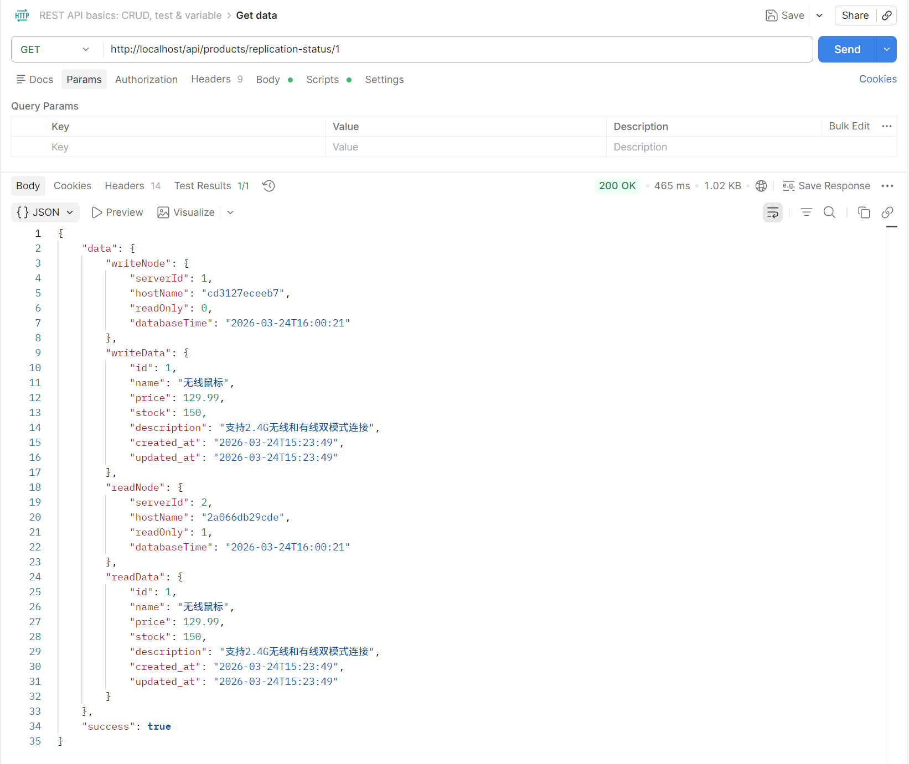
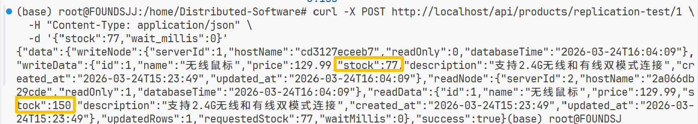
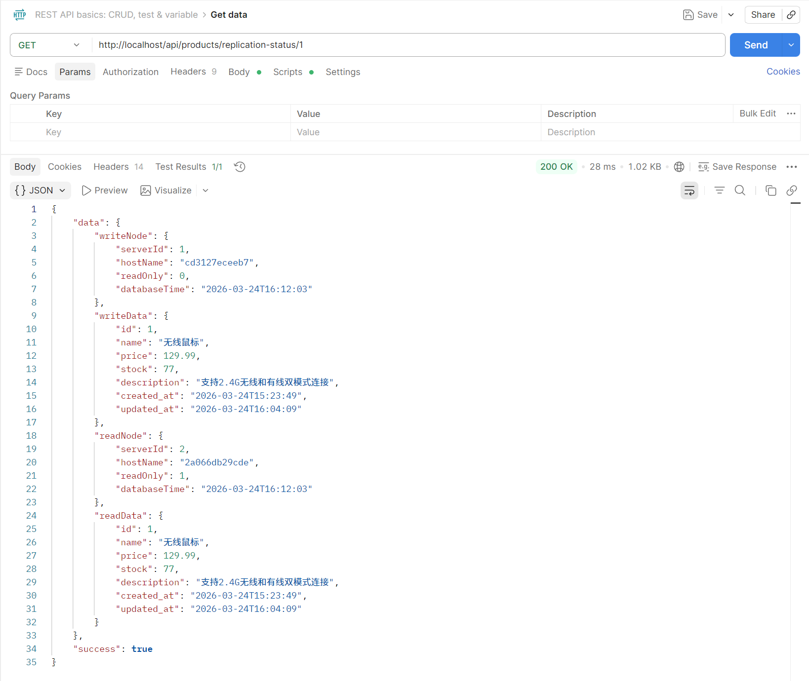
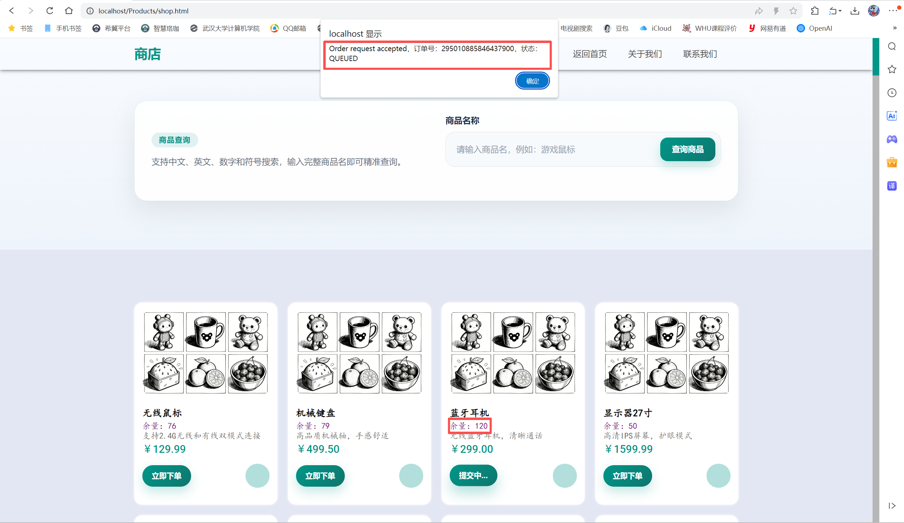
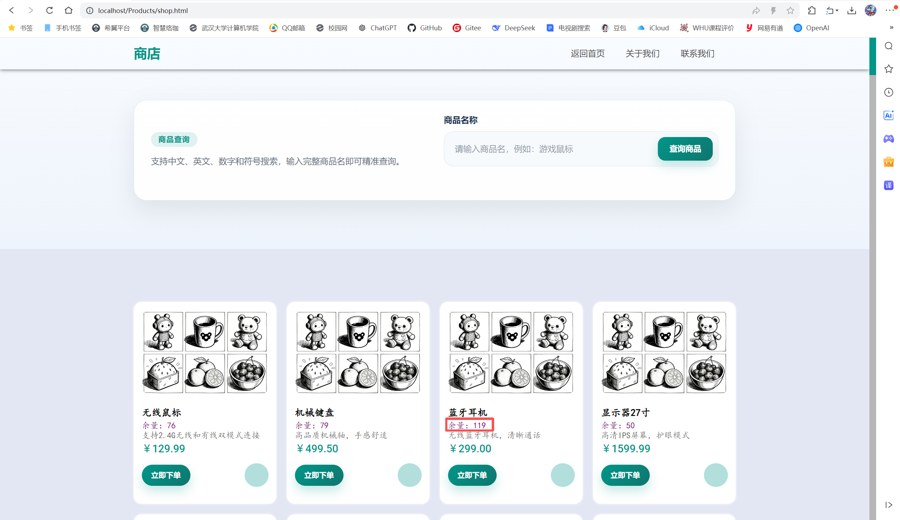

# 目录

- [第一次作业](#第一次作业)
  - [系统设计文档](#一系统设计文档)
  - [环境准备](#二环境准备)
- [第二次作业](#第二次作业)
  - [容器环境](#一容器环境)
  - [负载均衡](#二负载均衡)
  - [动静分离](#三动静分离)
  - [分布式缓存](#四分布式缓存)
- [第三次作业](#第三次作业)
  - [分布式缓存](#一分布式缓存-1)
  - [读写分离](#二读写分离)
- [第四次作业](#第四次作业)
  - [消息队列](#消息队列)
- [第五次作业](#第五次作业)
  - [事务与一致性](#事务与一致性)
- [第六次作业](#第六次作业)
  - [服务注册发现与配置](#服务注册发现与配置)
  - [流量治理](#流量治理)

---

# 第一次作业

## 一、系统设计文档

本节概述系统整体方案，主要包括服务拆分、API 设计、数据库模型和技术栈选型。

### 1. 绘制系统架构草图（[系统架构草图源码](graph/系统架构图.md)）

系统架构草图展示了前端、网关、服务集群、配置中心、注册中心与数据库之间的协作关系，是后续服务拆分与接口设计的基础。


### 2. 定义各服务API接口

当前已落地的接口主要集中在用户认证服务和商品服务，统一由 `Nginx` 以 `/api/**` 暴露并转发到后端 Spring Boot 实例。结合现有前端调用、控制器实现和后续四服务拆分方案，可将 API 分为“已实现接口”和“设计接口”两类。

#### 1） 用户服务（User Service）

已实现接口如下：

| 接口 | 方法 | 说明 | 请求参数 | 返回结果 |
| --- | --- | --- | --- | --- |
| `/api/auth/register` | `POST` | 用户注册 | JSON：`username`、`phone_number`、`password` | `success`、`message` |
| `/api/auth/login` | `POST` | 用户登录 | JSON：`username`、`password` | `success`、`message`、`user`，并写入 `SESSIONID` Cookie |
| `/api/auth/me` | `GET` | 获取当前登录用户信息 | Cookie：`SESSIONID` | `success`、`user` |
| `/api/auth/logout` | `POST` | 用户退出登录 | Cookie：`SESSIONID` | `success`、`message` |

接口来源与依据：

- 前端 `Front_End/LogUp.js` 调用 `/api/auth/register` 完成注册。
- 前端 `Front_End/LogIn.js` 调用 `/api/auth/login` 完成登录，并依赖后端返回的会话Cookie。
- 后端 `AuthController` 已实现 `register`、`login`、`me`、`logout` 四个接口。
- `SessionService` 使用 Redis 保存会话，说明当前登录态已具备分布式部署所需的共享能力。

#### 2） 商品服务（Product Service）

已实现接口如下：

| 接口 | 方法 | 说明 | 请求参数 | 返回结果 |
| --- | --- | --- | --- | --- |
| `/api/products/info` | `GET` | 查询全部商品列表 | 无 | `success`、`number`、`datas` |
| `/api/products/{id}` | `GET` | 按商品ID查询商品 | 路径参数：`id` | `success`、`data` |
| `/api/products/by-name` | `GET` | 按商品名称查询商品 | 查询参数：`name` | `success`、`data` |

接口来源与依据：

- 前端 `Front_End/Products/shop.js` 调用 `/api/products/info` 拉取商品列表并渲染商城页面。
- 前端 `Front_End/Products/query.js` 调用 `/api/products/by-name?name=...` 实现商品搜索。
- 后端 `ProductController` 已实现全部商品查询、按ID查询、按名称查询三个接口。
- 当前商品数据直接包含 `stock` 字段，因此前端可直接展示库存。

#### 3） 订单服务（Order Service）

订单服务当前尚未落地控制器和前端调用，但可根据已设计的 `orders` 表和整体 ER 图定义以下接口：

| 接口 | 方法 | 说明 | 关键参数 |
| --- | --- | --- | --- |
| `/api/orders` | `POST` | 创建订单 | JSON：`user_id`、`items`、收货信息 |
| `/api/orders/{id}` | `GET` | 查询订单详情 | 路径参数：`id` |
| `/api/orders` | `GET` | 查询当前用户订单列表 | 查询参数：`user_id`、`status`、`page`、`size` |
| `/api/orders/{id}/cancel` | `POST` | 取消订单 | 路径参数：`id` |
| `/api/orders/{id}/pay` | `POST` | 支付成功后更新订单状态 | 路径参数：`id` |
| `/api/orders/{id}/status` | `PATCH` | 管理员或系统更新订单状态 | 路径参数：`id`，JSON：`status` |

推荐返回字段：

- 订单主信息：`id`、`order_no`、`user_id`、`total_amount`、`status`
- 收货信息：`receiver_name`、`receiver_phone`、`receiver_address`
- 订单明细：`items` 数组，包含 `product_id`、`quantity`、`unit_price`、`subtotal`

在分布式架构中，订单服务是核心协调者。创建订单时应先校验用户，再获取商品价格快照，最后调用库存服务扣减库存。

#### 4） 库存服务（Inventory Service）

库存服务当前也尚未落地控制器，但可根据已设计的 `inventory` 表定义以下接口：

| 接口 | 方法 | 说明 | 关键参数 |
| --- | --- | --- | --- |
| `/api/inventory/{productId}` | `GET` | 查询指定商品库存 | 路径参数：`productId` |
| `/api/inventory/deduct` | `POST` | 扣减库存 | JSON：`product_id`、`quantity` |
| `/api/inventory/release` | `POST` | 释放库存，通常用于取消订单 | JSON：`product_id`、`quantity` |
| `/api/inventory/lock` | `POST` | 预锁定库存，防止超卖 | JSON：`product_id`、`quantity` |
| `/api/inventory/{productId}` | `PUT` | 管理员修改库存数量或预警阈值 | 路径参数：`productId` |
| `/api/inventory/alert` | `GET` | 查询低库存商品 | 查询参数：`threshold` |

推荐返回字段：

- `product_id`
- `stock_quantity`
- `locked_quantity`
- `warning_threshold`
- `success`
- `message`

#### 5） 网关层API路由约定

结合 `nginx/conf.d/default.conf` 的当前配置，系统对外统一入口仍为 `location /api/`。后续服务拆分后可继续保留这一前缀，再由网关按路径转发：

| 路径前缀 | 对应服务 |
| --- | --- |
| `/api/auth/**`、`/api/users/**` | 用户服务 |
| `/api/products/**` | 商品服务 |
| `/api/orders/**` | 订单服务 |
| `/api/inventory/**` | 库存服务 |

这样设计有两个好处：

- 前端调用方式保持稳定，后续即使将单体后端拆成多个微服务，也无需大规模修改页面代码。
- 各服务职责边界清晰，既便于课程报告展示服务拆分，也便于后续扩展数据库和远程调用逻辑。

### 3. 数据库ER图

数据库设计围绕用户、商品、库存和订单四类核心业务对象展开，并通过整体 ER 图展示表之间的关联关系，便于后续服务拆分与接口联调。

- 用户表（[用户表源码](graph/用户表.md)）
  
  

- 商品表（[商品表源码](graph/商品表.md)）
  
  

- 库存表（[库存表源码](graph/库存表.md)）
  
  

- 订单表（[订单表源码](graph/订单表.md)）
  
  

- 整体ER图（[整体ER图源码](graph/整体ER图.md)）
  
  

### 4. 技术栈选型说明

从当前仓库可以明确看出项目的基础技术选型：后端使用 `Spring Boot 3 + MyBatis`，数据库使用 `MySQL`，缓存与会话使用 `Redis`，前端使用原生 `HTML + CSS + JavaScript`，反向代理与静态资源承载使用 `Nginx`。

相关文件或目录：
- `Back_End/Log/pom.xml`
- `Back_End/Log/src/main/resources/application.properties`
- `Front_End/`
- `nginx/conf.d/default.conf`
- `docker-compose.yml`

实现说明：
- `pom.xml` 中已经引入 `spring-boot-starter-web`、`mybatis-spring-boot-starter`、`mysql-connector-j`、`spring-boot-starter-security`、`spring-boot-starter-data-redis`。
- `application.properties` 中已配置 MySQL、Redis、MyBatis 和服务端口。
- 前端页面与脚本位于 `Front_End/`，说明项目采用前后端分离的基础结构。

## 二、环境准备

本节说明项目从代码仓库初始化到本地开发环境搭建的过程，为后续功能开发、容器化部署和分布式实验提供统一基础。

### 1. 初始化项目代码仓库（Git）
仓库已经完成Git初始化，项目根目录存在 `.git`、`.gitignore` 等版本管理文件。

相关文件或目录：
- `.git/`
- `.gitignore`
- `.gitattributes`

### 2. 搭建基础开发环境（Spring Boot + MyBatis + MySQL）
仓库中已搭建可运行的 Java 后端工程，并完成数据库脚本、Mapper、配置文件和打包产物的组织。

相关文件或目录：
- `Back_End/Log/`
- `Back_End/Log/pom.xml`
- `Back_End/Log/src/main/resources/application.properties`
- `Back_End/Log/src/main/resources/mapper/`
- `Database/Log_SQL/init_users_table.sql`
- `Database/Product_SQL/init_products_table.sql`

实现说明：
- `Back_End/Log/` 是Maven工程，具备标准的 `src/main/java`、`src/main/resources` 结构。
- `application.properties` 完成了数据库连接、Redis连接、MyBatis映射位置、服务端口等配置。
- `Database/` 下保存了用户表和商品表初始化 SQL，说明本地开发环境所需的数据库结构已准备完成。

### 3. 搭建一个项目代码框架，实现简单的用户注册登录功能
该功能已完成，包含前端注册页与登录页、后端注册/登录接口、数据库持久化、密码加密和基于 Redis 的会话管理。

相关文件或目录：
- `Front_End/LogUp.html`
- `Front_End/LogUp.js`
- `Front_End/LogIn.html`
- `Front_End/LogIn.js`
- `Back_End/Log/src/main/java/com/example/auth/controller/AuthController.java`
- `Back_End/Log/src/main/java/com/example/auth/service/UserService.java`
- `Back_End/Log/src/main/java/com/example/auth/service/SessionService.java`
- `Back_End/Log/src/main/java/com/example/auth/util/PasswordUtil.java`
- `Back_End/Log/src/main/java/com/example/auth/mapper/UserMapper.java`
- `Back_End/Log/src/main/resources/mapper/UserMapper.xml`
- `Database/Log_SQL/init_users_table.sql`

实现说明：
- 前端通过 `LogUp.html + LogUp.js` 发起注册请求，通过 `LogIn.html + LogIn.js` 发起登录请求。
- `AuthController` 提供 `/api/auth/register`、`/api/auth/login`、`/api/auth/me`、`/api/auth/logout` 接口。
- `UserService` 负责用户名/手机号唯一性校验、密码加密、登录校验和最后登录时间更新。
- `PasswordUtil` 使用 BCrypt 处理密码哈希，避免明文存储。
- `SessionService` 将登录态写入 Redis，并通过 `SESSIONID` Cookie 维持会话。

---

# 第二次作业

## 一、容器环境

本节说明项目的容器化部署方式，展示数据库、缓存、后端服务与网关如何通过统一编排文件启动并协同工作。

### 1. 配置项目的docker-compose文件，将数据库、后端服务、Nginx分别使用容器进行启动和加载
仓库中已提交 `docker-compose.yml`，其中包含 `mysql`、`redis`、`backend1`、`backend2`、`nginx` 五个服务；同时还提供了 `Docker-Deployment.md` 说明容器部署过程。

相关文件或目录：
- `docker-compose.yml`
- `Docker-Deployment.md`
- `nginx/conf.d/default.conf`

实现说明：
- `docker-compose.yml` 中配置了数据库容器、Redis容器、两个后端实例和Nginx容器。
- Nginx 挂载 `Front_End/` 作为静态资源目录，挂载 `nginx/conf.d/` 作为代理配置目录。
- 结合仓库现状，这部分已完成容器编排配置与部署说明。

## 二、负载均衡

本节展示系统从单实例走向多实例部署后的访问分发方案，重点说明 Nginx 代理转发、负载均衡算法和压力测试验证过程。

### 1. 后端服务启动多个实例，并分别开启不同REST端口（如 8081 和 8082）
该部分已完成配置。

相关文件或目录：
- `docker-compose.yml`

实现说明：
- `backend1` 对外映射 `8081:9090`。
- `backend2` 对外映射 `8082:9090`。
- 两个实例复用同一套后端工程，用于模拟多实例部署。

### 2. 通过Nginx（如 80 端口）进行代理和转发
该部分已完成配置。

相关文件或目录：
- `nginx/conf.d/default.conf`
- `docker-compose.yml`

实现说明：
- Nginx监听 `80` 端口。
- `/api/` 路径通过 `proxy_pass` 转发到后端 upstream。
- 转发时保留了 `Host`、`X-Real-IP`、`X-Forwarded-For` 等头信息。

### 3. 尝试为Nginx配置不同的负载均衡算法
该部分已完成配置。

相关文件或目录：
- `nginx/conf.d/default.conf`

实现说明：
- 已配置 `backend_round_robin`。
- 已配置 `backend_least_conn`。
- 已配置 `backend_ip_hash`。
- 当前 `location /api/` 默认使用 `backend_round_robin`，其余算法可通过修改 `proxy_pass` 指向切换测试。

### 4. 使用JMeter进行压力测试
仓库中已经保留JMeter压测结果截图与说明材料。

相关文件或目录：
- `README.md`
- `graph/back_test.png`
- `graph/back_test1.png`

实现说明：
- `README.md` 中记录了后端接口压测思路。
- `graph/back_test.png`、`graph/back_test1.png` 为压测结果截图，可作为展示材料。

### 5. 观察响应时间，并检查后端日志，验证各后端处理的请求数是否大致相等
仓库中已有对应说明材料。

相关文件或目录：
- `README.md`
- `Docker-Deployment.md`

实现说明：
- 文档中已经给出通过 `docker compose logs -f backend1 backend2` 查看后端日志的方式。
- 结合多实例和轮询策略，可以观察请求是否被较均匀地分发到两个后端实例。

## 三、动静分离

本节说明前端静态资源与后端动态接口的访问路径拆分方式，通过 Nginx 完成静态资源直出和动态请求转发，提升部署清晰度与访问效率。

### 1. 编写一个简单的前端HTML文件，可以包括CSS、JS等
该部分已完成，且不仅包含单个页面，还包括首页、注册页、登录页和商品页。

相关文件或目录：
- `Front_End/index.html`
- `Front_End/LogIn.html`
- `Front_End/LogUp.html`
- `Front_End/Products/shop.html`
- `Front_End/assets/css/`
- `Front_End/LogIn.js`
- `Front_End/LogUp.js`
- `Front_End/Products/shop.js`
- `Front_End/Products/query.js`

实现说明：
- `Front_End/` 下已组织出完整的静态页面资源。
- 页面样式、图片和脚本资源拆分明确，便于直接由 Nginx 提供静态访问。

### 2. 在Nginx中配置动静分离
该部分已完成配置。

相关文件或目录：
- `nginx/conf.d/default.conf`
- `Front_End/`

实现说明：
- `/` 路径直接返回静态页面，根目录指向 `/usr/share/nginx/html`。
- `/api/` 路径代理到后端服务。
- `/static/` 路径配置了静态资源缓存时间 `expires 1h`。
- 说明仓库已按“静态资源由 Nginx 提供，动态请求转发到后端”的方式完成动静分离。

### 3. 使用JMeter分别压测静态文件以及后端服务，观察响应时间
仓库中已有对应截图和说明材料。

相关文件或目录：
- `README.md`
- `graph/front_test.png`
- `graph/back_test.png`
- `graph/back_test1.png`

实现说明：
- `graph/front_test.png` 对应静态页面压测结果。
- `graph/back_test.png`、`graph/back_test1.png` 对应后端接口压测结果。
- `README.md` 中也对静态资源和后端接口的压测方法进行了说明。

## 四、分布式缓存

本节围绕商品查询场景引入 Redis，说明缓存接入方式，以及对缓存穿透、击穿、雪崩等典型问题的处理策略。

### 1. 引入Redis缓存，实现商品详情页缓存
该部分已完成。

相关文件或目录：
- `Back_End/Log/pom.xml`
- `Back_End/Log/src/main/resources/application.properties`
- `Back_End/Log/src/main/java/com/example/auth/controller/ProductController.java`
- `Back_End/Log/src/main/java/com/example/auth/service/ProductService.java`
- `Back_End/Log/src/main/java/com/example/auth/service/JsonUtil.java`
- `Back_End/Log/src/main/java/com/example/auth/mapper/ProductMapper.java`
- `Back_End/Log/src/main/resources/mapper/ProductMapper.xml`
- `Database/Product_SQL/init_products_table.sql`
- `Front_End/Products/shop.html`
- `Front_End/Products/query.js`

实现说明：
- `ProductController` 提供 `/api/products/{id}` 和 `/api/products/by-name` 等接口。
- `ProductService#getProductById` 优先从 Redis 读取商品详情，缓存未命中时回源 MySQL，再将结果写回 Redis。
- 前端商品页面和查询脚本可以访问商品查询接口，形成“商品详情页缓存”的业务链路。

### 2. 处理缓存穿透、击穿、雪崩问题
该部分已完成。

相关文件或目录：
- `Back_End/Log/src/main/java/com/example/auth/service/ProductService.java`
- `README.md`

实现说明：
- 缓存穿透：对不存在的商品写入 `NULL` 占位值，并设置 2 分钟过期时间。
- 缓存击穿：使用 `setIfAbsent` 实现互斥锁 `lock:product:{id}`，防止热点Key同时回源。
- 缓存雪崩：商品缓存TTL使用 30 到 40 分钟的随机值，避免大量Key同时失效。

---

# 第三次作业

## 一、分布式缓存

本节对应第三次作业，继续基于现有实现总结 Redis 缓存方案，并从报告角度归纳关键实现。

### 1. 引入Redis，实现商品详情页缓存
该部分与第二次作业中的商品缓存实现一致，已落在当前代码仓库中。

相关文件或目录：
- `Back_End/Log/src/main/java/com/example/auth/controller/ProductController.java`
- `Back_End/Log/src/main/java/com/example/auth/service/ProductService.java`
- `Back_End/Log/src/main/java/com/example/auth/service/JsonUtil.java`
- `Back_End/Log/src/main/resources/application.properties`
- `Back_End/Log/pom.xml`

### 2. 处理缓存穿透、击穿、雪崩问题
该部分已经在当前实现中完成。

相关文件或目录：
- `Back_End/Log/src/main/java/com/example/auth/service/ProductService.java`
- `README.md`

实现说明：
- 穿透、击穿、雪崩三类问题的处理逻辑均集中在 `ProductService#getProductById` 中。
- `README.md` 也对相应策略做了总结，便于老师和助教快速核对。

## 二、读写分离

本节结合商品搜索页面展示读写分离的实现与测试效果。

### 1. 搭建MySQL的读写分离环境，在代码中测试读写分离效果

该部分基于当前 `Spring Boot + MyBatis + MySQL` 后端项目实现了 MySQL 主从复制与应用层读写分离。整体方案是：`mysql-master` 作为写库，`mysql-slave` 作为读库；后端通过动态数据源根据事务的只读属性自动路由，从而实现“写入走主库、查询走从库”。

**1. 读写分离功能实现**

相关文件或目录：
- `Back_End/Log/src/main/resources/application.properties`
- `Back_End/Log/src/main/java/com/example/auth/config/DataSourceConfig.java`
- `Back_End/Log/src/main/java/com/example/auth/config/RoutingDataSource.java`
- `Back_End/Log/src/main/java/com/example/auth/service/ProductService.java`
- `Back_End/Log/src/main/java/com/example/auth/service/UserService.java`
- `Back_End/Log/src/main/java/com/example/auth/service/ProductReplicationService.java`
- `Back_End/Log/src/main/java/com/example/auth/controller/ProductController.java`
- `Back_End/Log/Dockerfile`
- `docker-compose.yml`
- `Database/MySQL_RW/master/my.cnf`
- `Database/MySQL_RW/master/init.sql`
- `Database/MySQL_RW/master/replication-user.sql`
- `Database/MySQL_RW/slave/my.cnf`
- `Database/MySQL_RW/slave/start-replication.sql`

实现说明：
- `application.properties` 中新增了 `spring.datasource.write.*` 和 `spring.datasource.read.*` 两套配置，分别对应主库和从库。
- `DataSourceConfig.java` 负责注册 `writeDataSource`、`readDataSource` 和路由数据源 `dataSource`，并额外提供 `writeJdbcTemplate`、`readJdbcTemplate` 便于测试。
- `RoutingDataSource.java` 继承 `AbstractRoutingDataSource`，通过 `TransactionSynchronizationManager.isCurrentTransactionReadOnly()` 判断当前事务是否为只读事务；只读事务路由到 `read`，否则路由到 `write`。
- `ProductService.java` 中的 `getProductById`、`getProductByName`、`getAllProducts` 标注为 `@Transactional(readOnly = true)`，因此商品查询优先走从库。
- `UserService.java` 中的 `findById`、`findByPhoneNumber`、`findByUserName` 标注为只读事务，而 `registerUser` 和 `validateLogin` 使用普通 `@Transactional`，因此注册和登录中的写操作会路由到主库。
- `ProductReplicationService.java` 用于读写分离实验：先通过 `writeJdbcTemplate` 更新主库数据，再分别查询主库和从库，直观对比差异。
- `ProductController.java` 新增 `/api/products/replication-status/{id}` 和 `/api/products/replication-test/{id}` 两个接口，分别用于查看主从状态和执行写入测试。
- `Database/MySQL_RW/master/my.cnf`、`replication-user.sql` 用于配置主库复制能力并创建复制账号 `repl`。
- `Database/MySQL_RW/slave/my.cnf`、`start-replication.sql` 用于配置从库并建立主从复制关系，同时开启 `read_only` 和 `super_read_only`。
- `docker-compose.yml` 将 `mysql-master`、`mysql-slave`、`mysql-replica-init`、`backend1`、`backend2`、`redis` 和 `nginx` 组合在同一套部署环境中，后端实例通过环境变量指定读写库。
- `Back_End/Log/Dockerfile` 用于将后端打包为容器镜像，便于在 WSL2 + Docker 环境中统一部署和测试。

**2. 读写分离功能测试**

为验证系统已实现“写主库、读从库”以及“主从复制延迟后最终一致”，本项目在 WSL2 + Docker 环境中通过 `curl` 对后端接口进行了三次连续测试。测试过程中，所有写操作都落在主库，从库通过 MySQL 主从复制异步同步。

测试步骤与结果如下：

1. 首先查询商品 `id = 1` 在主从库中的初始状态：

```bash
curl http://localhost/api/products/replication-status/1
```

查询结果如下图所示：



返回结果中可以同时看到 `writeNode`、`writeData`、`readNode` 和 `readData`，说明接口已能分别读取主库和从库中的商品信息。初始状态下，两者的 `stock` 一致。

2. 接着对同一个商品执行写入操作，将 `stock` 修改为 `77`，并在写入后立即同时读取主从库信息：

```bash
curl -X POST http://localhost/api/products/replication-test/1 \
  -H "Content-Type: application/json" \
  -d '{"stock":77,"wait_millis":0}'
```

 测试结果如下图所示：

 

可以看到，主库中的 `writeData.stock` 已变为 `77`，说明写操作已成功写入主库；但此时从库中的 `readData.stock` 尚未同步到 `77`，说明从库读取的仍是复制前的数据，直观体现了主从复制延迟。

3. 间隔一段时间后，再次查询该商品的主从状态：

```bash
curl http://localhost/api/products/replication-status/1
```

测试结果如下图所示：

 

可以看到，经过短暂延迟后，从库中的 `readData.stock` 也变为 `77`，说明主库写入已通过 MySQL 主从复制成功同步到从库。

综合三次测试可以得出结论：本项目已在 Docker 部署环境中成功搭建 MySQL 主从复制与应用层读写分离机制，能够清楚观察到“写入先到主库、查询优先走从库、随后主从逐步一致”的效果。


### 2. 基于 Elasticsearch 实现商品搜索功能

为便于展示搜索模块的交互效果，本节从商品详情、查询成功和查询失败三个场景进行说明。

**商品详情界面**

 

- 商品名称、价格、库存和描述等核心信息集中展示，便于快速浏览。
- 页面保留明确的查询入口，方便继续按商品名称搜索。
- 商品信息与库存字段同时呈现，便于直观观察业务数据之间的关联。

**查询成功界面**


- 查询命中目标商品后，页面会立即返回对应商品信息。
- 查询状态与商品详情同步展示，便于用户快速判断结果是否正确。
- 从输入关键词到返回结果形成完整闭环，能够体现搜索功能的可用性。

**查询失败界面**

 

- 当商品不存在或未命中搜索条件时，页面会及时给出失败提示。
- 提示信息语义清晰，便于用户调整关键字后重新查询。
- 正常场景与异常场景均有对应反馈，体现了系统交互的完整性与容错性。

---

# 第四次作业

## 消息队列

### 1. 实现秒杀下单功能，建议Redis缓存库存，Kafka异步处理订单创建，削峰填谷

**实现逻辑**

本次在现有登录、商品查询、Redis 会话和 MySQL 主从读写分离的基础上，新增了独立的秒杀下单后端 `Back_End/Order`，并将秒杀链路拆分为“同步快速校验 + 异步订单创建”两个阶段。用户在前端商品页点击“立即下单”后，浏览器会携带登录后的 `SESSIONID` Cookie 向 `/api/seckill/orders` 发送请求，请求体仅包含商品名称 `product_name`。后端先根据 Redis 中的会话信息识别当前用户，再按商品名称查询对应商品。

为应对秒杀高并发场景，库存校验与去重并不直接落库，而是先在 Redis 中完成。系统为每个商品维护秒杀库存键和“已下单用户集合”，并通过 Lua 脚本原子执行以下操作：检查库存是否存在、判断用户是否已抢购、判断库存是否大于 0；若检查通过，则扣减库存、记录用户参与状态，并写入订单处理中状态 `QUEUED`。由于 Lua 脚本在 Redis 中原子执行，因此可以避免并发条件下的超卖和重复下单。

Redis 侧预扣库存成功后，系统会使用雪花算法生成全局唯一订单号，并将订单消息写入 Kafka 的 `seckill-order-topic`。这样用户请求无需同步等待数据库写入，而是由消息队列承担削峰填谷作用，将高并发请求转化为后端可持续消费的异步消息流。Kafka 消费者在后台监听该主题，读取消息后进入数据库事务：先检查订单号是否已存在，再检查同一用户与同一商品是否已有订单记录，最后执行数据库库存扣减和订单插入。数据库中的 `seckill_orders` 表通过 `(user_id, product_id)` 唯一约束再次兜底，保证同一用户同一商品只能成功创建一条订单。

如果 Kafka 发送失败、数据库扣库存失败、商品不存在或消费者处理异常，系统会执行补偿逻辑：恢复 Redis 中已预扣的库存，移除该用户在商品维度上的秒杀标记，并将订单状态改为失败。这样即使异步阶段出现异常，也能避免库存长期错误减少，防止订单处于半完成状态。整体上，这套方案实现了“Redis 快速挡流量、Kafka 异步削峰、MySQL 最终一致落库”的秒杀下单流程。

**代码概括介绍**

秒杀下单后端的核心代码集中在 `Back_End/Order` 模块中。`SeckillOrderController.java` 提供 `/api/seckill/orders` 下单接口和订单查询接口；下单接口从请求体读取 `product_name`，并从 Cookie 中提取 `SESSIONID` 识别用户身份。`SessionService.java` 负责根据 Redis 中的会话键值还原当前用户 ID。`ProductMapper.java` 与 `ProductMapper.xml` 新增了按商品名称查询商品的能力，用于将前端传入的商品名称映射为实际商品记录。

秒杀核心逻辑位于 `OrderService.java`。该类内部定义了 Redis Lua 脚本，用于一次性完成库存检查、重复下单检查、库存扣减和下单状态写入；同时封装了订单状态键、库存键和用户去重键的命名规则。下单入口 `submitSeckillOrder` 会先根据商品名称查询商品，再生成订单号并执行 Redis 预扣减逻辑；预扣减成功后构造 `SeckillOrderMessage` 并投递到 Kafka。若 Kafka 投递失败，则调用补偿方法回滚 Redis 中的预扣减状态。订单消费者 `SeckillOrderConsumer.java` 通过 `@KafkaListener` 监听秒杀主题，读取消息后调用 `createOrder` 进入数据库事务，完成库存最终扣减和订单持久化。

为提升部署稳定性，`SeckillOrderProducer.java` 将消息发送改为同步确认，只有 Kafka 真正接收成功后才认为请求进入异步处理队列；`KafkaTopicConfig.java` 会在服务启动时自动创建 `seckill-order-topic`，减少因主题不存在导致的消费异常。订单 ID 由 `OrderIdGenerator.java` 负责生成，采用雪花算法思路，保证在单节点部署下也能生成趋势递增且全局唯一的长整型订单号。

数据库层面，`Database/MySQL_RW/master/init.sql` 中新增了 `seckill_orders` 表，字段包含订单号、用户 ID、商品 ID、订单金额、订单状态和时间戳信息，并为 `(user_id, product_id)` 建立唯一索引，用于保证幂等性。部署层面，`docker-compose.yml` 新增了 `kafka` 服务和 `backend-order` 服务，`nginx/conf.d/default.conf` 也新增了 `/api/seckill/orders` 到 `backend-order` 的转发规则。前端方面，`Front_End/Products/shop.js` 为动态渲染的商品卡片增加了“立即下单”按钮，`Front_End/Products/order.js` 负责携带 Cookie 发起秒杀请求并展示结果，实现了完整的前后端联动。

**界面展示**

- **秒杀下单**：用户点击购买按钮后，系统会将订单加入等待队列，之后由Kafka异步处理订单。
  

- **刷新订单**：当Kafka异步处理完订单后，商品的库存会减少相应数量。
  

# 第五次作业
## 事务与一致性
### 1、在秒杀下单时，基于Redis实现库存预扣减，防超卖、限购

当前秒杀下单会先经过 `Back_End/Order/src/main/java/com/example/order/service/OrderService.java` 中的 Redis Lua 脚本，再进入后续异步链路。脚本会同时检查商品库存键、商品维度的已下单用户集合，以及用户对应的待处理订单键：若库存不存在则直接失败，若用户已参与过该商品秒杀则拒绝重复下单，若库存不足则返回售空；只有全部条件满足时，才会原子执行库存减一、将用户写入限购集合、写入待处理订单标记，并把 Redis 订单状态设为 `QUEUED`。这样将“查库存、扣库存、限购去重”合并为一个原子操作，在高并发下可以有效防止超卖和重复抢购。相关文件主要包括 `OrderService.java`、`SeckillOrderController.java`、`StockWarmupService.java`、`Front_End/Products/order.js` 和 `Database/MySQL_RW/master/init.sql`。

### 2、采用基于消息的一致性或TCC事务保障数据一致性

- 下单 + 库存扣减一致性  
  本项目采用基于消息的一致性方案处理“下单 + 库存扣减”。用户请求先在 Redis 中完成预扣减并生成待处理订单，然后订单服务发送扣库存消息到 Kafka；库存服务消费消息后真正扣减数据库库存，并回传扣减结果消息。订单服务再根据结果将订单从 `PENDING_STOCK` 更新为 `CREATED`，或在失败时关闭订单并回滚 Redis 中的预占库存、去重集合和待处理标记，从而保证订单与库存状态最终一致。
- 订单支付 + 订单状态更新一致性  
  订单支付链路同样使用消息一致性保证状态正确流转。订单服务在发起支付前先将订单状态从 `CREATED` 或 `PAY_FAILED` 原子更新为 `PAYING`，随后发送支付请求消息；支付结果返回后，由 `PaymentResultConsumer.java` 消费回执并调用 `OrderService.handlePaymentResult`，将订单状态更新为 `PAID` 或 `PAY_FAILED`，同时刷新 Redis 中的订单状态。这样可以避免“支付成功但订单状态未更新”以及重复支付造成的状态混乱。

# 第六次作业

## 服务注册发现与配置

### 1、搭建Nacos环境实现服务注册、配置管理，结合Spring Cloud Gateway服务网关
本次新增了 `Back_End/Gateway` 网关服务，并在 `docker-compose.yml` 中加入 `nacos` 与 `nacos-config-import`，用于完成服务注册发现和统一配置管理。`Log`、`Order`、`Inventory`、`Gateway` 四个服务均通过 `spring.application.name` 和 `spring.config.import=optional:nacos:...` 接入 Nacos，启动后会自动注册到注册中心并读取对应远程配置。

网关使用 `Spring Cloud Gateway` 实现统一入口，路由目标采用 `lb://auth-service`、`lb://order-service`、`lb://inventory-service` 这种服务名形式，说明请求转发依赖 Nacos 的服务发现能力。Nginx 只负责托管前端页面，并将 `/api/` 请求统一转发到 Gateway。

相关文件或目录：
- `docker-compose.yml`
- `Back_End/Nacos/configs/import.sh`
- `Back_End/Nacos/configs/auth-service.yaml`
- `Back_End/Nacos/configs/order-service.yaml`
- `Back_End/Nacos/configs/inventory-service.yaml`
- `Back_End/Nacos/configs/gateway-service.yaml`
- `Back_End/Gateway/pom.xml`
- `Back_End/Gateway/src/main/java/com/example/gateway/GatewayApplication.java`
- `Back_End/Gateway/src/main/java/com/example/gateway/config/KeyResolverConfig.java`
- `Back_End/Gateway/src/main/java/com/example/gateway/controller/GatewayFallbackController.java`
- `Back_End/Gateway/src/main/resources/application.properties`
- `Back_End/Log/src/main/resources/application.properties`
- `Back_End/Order/src/main/resources/application.properties`
- `Back_End/Inventory/src/main/resources/application.properties`
- `nginx/conf.d/default.conf`

实现说明：
- `docker-compose.yml` 中新增了 `nacos` 和 `nacos-config-import` 服务。
- 各后端服务均通过 `application.properties` 接入 Nacos。
- `Gateway` 负责统一 API 入口，`Nginx` 只转发到网关。

### 2、使用网关地址调用服务，测试动态服务路由的正确性
启动后可先在 Nacos 控制台查看 `auth-service`、`order-service`、`inventory-service`、`gateway-service` 是否已注册，然后分别访问以下地址测试动态路由：

```bash
curl http://localhost:8085/auth-service/api/products/info
curl http://localhost/api/products/info
curl "http://localhost:8085/order-service/api/seckill/orders?userId=1"
curl http://localhost:8085/inventory-service/api/inventory/products/1
```

如果以上请求都能返回正常结果，说明 Gateway 已经能够基于服务名进行动态转发，`/api/` 统一入口也已经生效。

相关文件或目录：
- `Back_End/Nacos/configs/gateway-service.yaml`
- `Back_End/Gateway/src/main/resources/application.properties`
- `nginx/conf.d/default.conf`
- `Front_End/LogIn.js`
- `Front_End/LogUp.js`
- `Front_End/Products/shop.js`
- `Front_End/Products/order.js`
- `Front_End/Products/pay.js`

实现说明：
- `gateway-service.yaml` 中通过 `lb://服务名` 配置路由目标。
- 前端仍然通过 `/api/...` 调用后端，无需关心具体容器端口。
- `backend1` 和 `backend2` 会作为同一服务的两个实例被网关负载均衡访问。

### 3、在代码中使用Nacos的属性，测试动态更新属性能力
本项目在 `auth-service` 中新增了配置演示接口 `ConfigDemoController.java`，通过 `@RefreshScope` 和 `@Value` 读取 Nacos 中的 `demo.message`、`traffic.demo.delay-millis`、`traffic.demo.force-failure` 等配置，并通过 `/api/config/demo` 返回当前值。

测试方式如下：

```bash
curl http://localhost/api/config/demo
```

随后在 Nacos 控制台修改 `auth-service.yaml` 中的 `demo.message` 或 `traffic.demo.delay-millis` 并发布，再次访问该接口。如果返回值发生变化，则说明动态刷新已经生效。

相关文件或目录：
- `Back_End/Log/src/main/java/com/example/auth/controller/ConfigDemoController.java`
- `Back_End/Log/src/main/resources/application.properties`
- `Back_End/Nacos/configs/auth-service.yaml`

实现说明：
- `ConfigDemoController.java` 使用 `@RefreshScope` 实现配置动态刷新。
- `/api/config/demo` 用于验证 Nacos 配置修改后是否立即生效。

## 流量治理

### 1、尝试对服务进行设置熔断、限流和降级
本项目在服务侧和网关侧都加入了流量治理。服务侧以 `auth-service` 为例，在 `TrafficDemoService.java` 中使用 `Resilience4j` 的 `@CircuitBreaker` 和 `@RateLimiter` 保护 `/api/traffic/unstable` 接口，并通过 `fallback` 方法返回降级结果。网关侧则在 `gateway-service.yaml` 中为路由配置了 `RequestRateLimiter` 和 `CircuitBreaker`，用于演示限流和统一回退。

相关文件或目录：
- `Back_End/Log/pom.xml`
- `Back_End/Log/src/main/java/com/example/auth/controller/TrafficDemoController.java`
- `Back_End/Log/src/main/java/com/example/auth/controller/TrafficGovernanceExceptionHandler.java`
- `Back_End/Log/src/main/java/com/example/auth/service/TrafficDemoService.java`
- `Back_End/Nacos/configs/auth-service.yaml`
- `Back_End/Gateway/src/main/java/com/example/gateway/config/KeyResolverConfig.java`
- `Back_End/Gateway/src/main/java/com/example/gateway/controller/GatewayFallbackController.java`
- `Back_End/Nacos/configs/gateway-service.yaml`

实现说明：
- `TrafficDemoService.java` 负责服务侧熔断、限流和降级。
- `TrafficGovernanceExceptionHandler.java` 将限流拒绝统一转换为 `429` 响应。
- `gateway-service.yaml` 和 `GatewayFallbackController.java` 负责网关侧限流与回退。

测试时，可以分别在 Nacos 中修改：

- `traffic.demo.force-failure=true`：模拟业务服务内部失败，观察服务降级响应；
- `traffic.demo.delay-millis=4000`：模拟业务服务超时，观察网关熔断和回退；
- 保持正常配置后对 `/api/traffic/unstable` 高频访问：观察限流返回的 `429` 响应。

### 2、使用JMeter进行压力测试，测试流量治理的效果
本项目在 `Back_End/JMeter` 目录中补充了压测说明和测试计划文件，可直接对 `http://localhost/api/traffic/unstable` 发起压力测试。测试时重点观察三类结果：正常请求返回 `200`，限流请求返回 `429`，熔断或回退请求返回 `503` 或带 `DEGRADED` 状态的 JSON。若三类结果都能稳定出现，则说明流量治理策略已经生效。

相关文件或目录：
- `Back_End/JMeter/README.md`
- `Back_End/JMeter/traffic-governance-test-plan.jmx`
- `Back_End/Log/src/main/java/com/example/auth/service/TrafficDemoService.java`
- `Back_End/Nacos/configs/auth-service.yaml`
- `Back_End/Nacos/configs/gateway-service.yaml`

实现说明：
- `traffic-governance-test-plan.jmx` 提供了现成的压测线程组。
- `README.md` 说明了限流、降级和网关回退的验证方法。
- JMeter 只作为外部压测工具使用，不参与业务服务部署。
