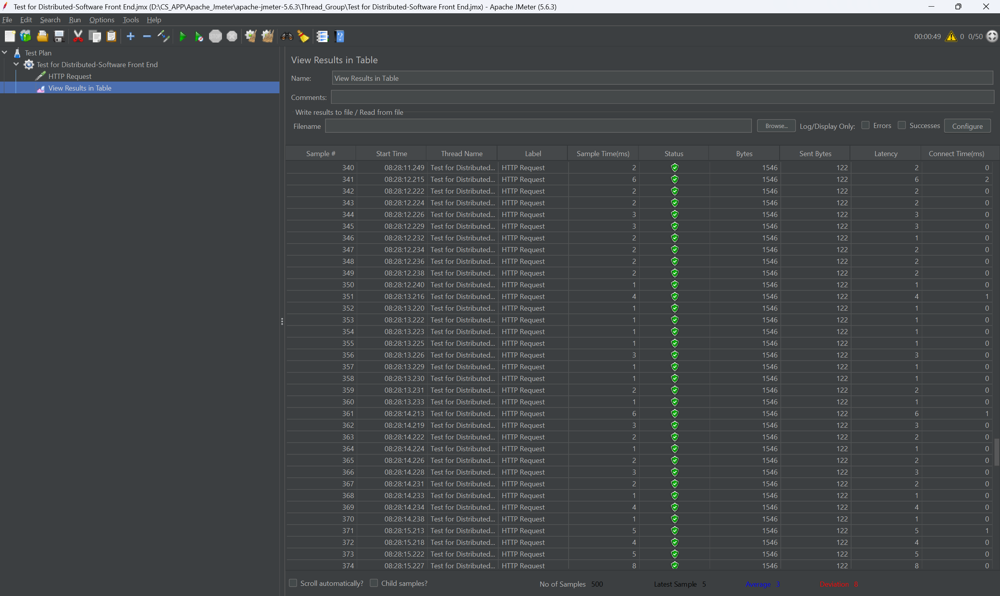
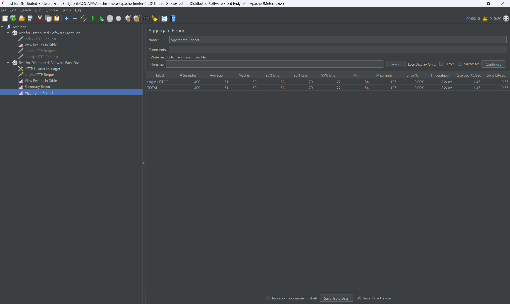
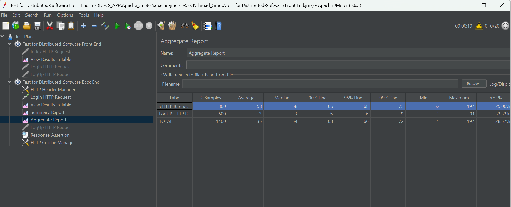

# 🛒 商品库存与秒杀系统

> 一个面向商品管理与秒杀场景的 Web 系统，支持用户注册、登录、主页浏览与交互式数据查看，适合作为课程设计、软件工程项目展示与前后端协同开发实践。作业完成情况请看[HW.md](./HW.md)。

---

## ✨ 项目亮点

- 🧭 **界面直观**：围绕商品库存与秒杀业务场景进行页面设计，整体结构清晰、上手容易。
- 🔐 **用户体系完整**：提供注册与登录入口，覆盖基础账户操作流程。
- 📊 **交互体验良好**：支持点击图表查看详细数据，便于展示库存与活动信息。
- 🧱 **适合项目展示**：包含主页、注册页、登录页等核心界面，便于课程汇报与仓库展示。

---

## 🚀 快速开始

```bash
git clone git@github.com:FOUNDSJJ/Distributed-Software.git
```

---

## 🐳 部署说明

### 📦 Docker 部署

🛠 **推荐先阅读部署文档**  
详细部署步骤请参考[Docker-Deployment.md](./Docker-Deployment.md)文件。

## 🖼️ 界面预览

### 🏠 项目主页


**页面特性：**
- 🪪 **账户入口清晰**：首页集成注册与登录入口，便于用户快速进入系统。
- 📈 **数据展示直观**：通过图表呈现业务信息，增强内容可读性。
- 🖱️ **支持交互查看**：用户可点击图表查看更详细的数据内容。

---

### 📝 注册页面


**页面特性：**
- 👤 **注册流程完整**：提供用户名、邮箱、密码等基础输入项，便于创建新账户。
- ✅ **表单反馈明确**：支持常见校验与提示信息，提升注册体验。
- 🔁 **页面跳转自然**：可从注册页快速切换至登录页。
- 🎨 **视觉风格统一**：背景与页面元素具备一定科技感，增强整体表现力。

---

### 🔐 登录页面


**页面特性：**
- 🔑 **登录入口直接**：支持用户输入账户信息后快速完成登录。
- 🛡️ **安全感更强**：密码隐藏输入等设计有助于提升使用体验与账户安全感。
- 🔄 **支持注册跳转**：新用户可从登录页便捷跳转至注册页。
- ⚡ **操作路径简洁**：按钮突出，交互流程清晰。
- 🖼️ **设计语言一致**：与注册页面保持统一风格，整体观感协调。

---

### 🛍️ 商品详情界面


**页面特性：**
- 🧾 **信息展示集中**：商品名称、价格、库存与描述等核心信息在同一界面内完整呈现。
- 🔍 **查询入口清晰**：支持用户围绕商品进行快速查找，便于定位目标数据。
- 📦 **业务字段完整**：界面联动商品状态与库存信息，便于后续展示与业务扩展。
- ✨ **交互反馈直观**：查询结果与详情信息切换顺畅，提升查看体验。

---

### ✅ 查询成功界面


**页面特性：**
- 🎯 **结果呈现明确**：成功命中商品后，界面可直接反馈对应商品信息。
- 📌 **状态可感知**：成功状态与数据内容同时展示，降低用户判断成本。
- 🔁 **查询路径闭环**：从查询输入到结果反馈形成完整闭环，便于展示功能可用性。

---

### ❌ 查询失败界面


**页面特性：**
- 🚨 **异常反馈及时**：当商品不存在或查询未命中时，界面可快速给出提示。
- 🧭 **信息表达清晰**：失败状态与提示语义明确，便于用户继续调整查询条件。
- 🛡️ **容错体验更完整**：将正常流程与异常场景一并展示，体现系统的稳定性与可用性。

---

## ⚙️ 后端实现

### 👤 注册功能

**功能内容：**
- 📥 接收用户名、手机号与密码，完成新用户注册。
- ✅ 校验用户名与手机号是否已存在，避免重复数据写入。

**实现方法：**
- 🧩 `AuthController` 接收 `/api/auth/register` 请求，先进行空值校验。
- 🗂️ `UserService` 调用 `UserMapper` 查重并组装 `User` 对象，写入 `users` 表。
- 🔐 密码通过 `BCryptPasswordEncoder` 加密后再入库，避免明文存储。

**技术栈：**
- ⚡ Spring Boot 3
- 🗃️ MyBatis
- 🐬 MySQL
- 🔒 Spring Security BCrypt

---

### 🔑 登录功能

**功能内容：**
- 🚪 支持用户输入账号密码进行身份验证。
- 🧾 登录成功后返回用户信息，并建立会话状态。

**实现方法：**
- 🧩 `AuthController` 处理 `/api/auth/login` 请求，校验参数完整性。
- 🔍 `UserService` 根据用户名查询用户，检查账号状态并使用 BCrypt 比对密码。
- 🧠 `SessionService` 将登录会话写入 Redis，生成 `SESSIONID` Cookie，TTL 为 24 小时。
- 🕒 登录成功后同步更新 `last_login` 字段，便于用户追踪与运维观察。

**技术栈：**
- ⚡ Spring Boot 3
- 🔒 Spring Security
- 🧠 Redis
- 🍪 Cookie Session

---

### 🔍 商品查询功能

**功能内容：**
- 📦 支持商品列表查询、按 ID 查询与按名称查询。
- 🧾 为商品详情页与查询成功/失败页提供统一数据支持。

**实现方法：**
- 🧩 `ProductController` 提供 `/api/products/info`、`/api/products/{id}`、`/api/products/by-name` 三类接口。
- 🗂️ `ProductMapper` 负责访问 MySQL `products` 表，完成商品列表与单商品查询。
- 🧠 `ProductService` 在 `getProductById` 中引入 Redis 缓存，优先读缓存，未命中再回源数据库。

**缓存策略：**
- 🛑 **缓存穿透**：对不存在的商品缓存 `NULL` 占位值，并设置 2 分钟过期时间，减少无效请求直打 MySQL。
- 🔒 **缓存击穿**：使用 `setIfAbsent` 实现 Redis 互斥锁，热点 Key 重建缓存时只允许一个请求回源。
- 🌨️ **缓存雪崩**：商品缓存过期时间采用 30-40 分钟随机 TTL，避免大量 Key 同时失效。
- ⚖️ **缓存与数据库协同**：在保证查询正确性的同时，有效降低数据库压力，提升热点商品访问效率。

**技术栈：**
- ⚡ Spring Boot 3
- 🗃️ MyBatis
- 🐬 MySQL
- 🧠 Redis
- 🔁 StringRedisTemplate

---

## 🧪 测试说明

为验证系统在实际运行中的可用性与稳定性，可使用 **Apache JMeter** 对前端静态页面与后端接口功能进行基础测试、并发测试与压力测试。

### 🔍 前端静态页面测试



前端页面主要包括主页、注册页、登录页等静态资源页面，可通过 JMeter 对页面访问性能进行测试。

**测试目标：**
- 🌐 验证静态页面是否能够被正常访问
- ⚡ 观察页面在并发访问下的响应时间表现
- 📦 检查 HTML、CSS、JS、图片等资源的加载情况
- 📈 为前端页面展示性能提供数据支持

**测试方法：**
- 在 JMeter 中创建 **Thread Group**
- 添加 **HTTP Request**，分别请求前端页面地址，例如：
  - `http://localhost/`
  - `http://localhost/login.html`
  - `http://localhost/logup.html`
- 可根据需要设置并发用户数、循环次数与启动时间
- 添加监听器查看测试结果，例如：
  - **View Results Tree**
  - **Summary Report**
  - **Aggregate Report**

**可关注指标：**
- 平均响应时间
- 吞吐量
- 错误率
- 最大/最小响应时间

### 🛠️ 后端功能测试



后端功能测试主要面向注册、登录、用户验证及相关业务接口，重点验证接口正确性与并发处理能力。

**测试目标：**
- 🔐 验证注册、登录等核心接口是否可正常工作
- 📨 检查请求参数与返回结果是否符合预期
- 🚦 测试后端在多用户并发访问下的稳定性
- 🗄️ 验证系统与数据库交互是否正常

**测试方法：**
- 在 JMeter 中创建 **Thread Group**
- 使用 **HTTP Request** 对后端接口发送 `GET` 或 `POST` 请求
- 若接口为 JSON 提交，可在线程组中添加：
  - **HTTP Header Manager**
  - `Content-Type: application/json`
- 在请求体中填写接口参数，例如用户名、邮箱、密码等
- 可结合 **CSV Data Set Config** 批量导入测试账号，模拟多用户请求

**示例测试场景：**
- 👤 用户注册接口测试
- 🔑 用户登录接口测试
- ✅ 非法输入校验测试
- 🔁 多用户并发登录测试
- 📊 秒杀相关接口的高并发访问测试

### 📋 测试结果分析



完成测试后，可从以下几个维度对系统表现进行分析：

- **功能正确性**：接口是否返回正确结果，页面是否能正常访问
- **性能表现**：响应时间是否稳定，吞吐量是否满足预期
- **稳定性**：高并发场景下是否出现报错、超时或服务异常
- **可优化点**：是否存在静态资源加载慢、接口响应慢、数据库压力过大等问题

### 💡 测试建议

- 建议先进行小规模功能验证，再逐步增加并发量
- 前端静态页面测试适合用于验证资源访问性能
- 后端接口测试更适合评估业务逻辑与服务承载能力
- 若系统包含秒杀业务，建议重点设计高并发压测场景
- 可将 JMeter 测试结果截图或导出报表用于课程答辩与项目展示

---

## 📌 适用场景

- 🎓 分布式软件原理与技术作业展示
- 💻 前后端分离项目练习
- 📦 商品库存管理系统原型演示
- ⏰ 秒杀业务场景页面展示

---

> 🚀 通过项目主页、注册页与登录页的完整展示，你可以快速了解本系统在库存管理与秒杀场景下的基础功能与交互设计。
