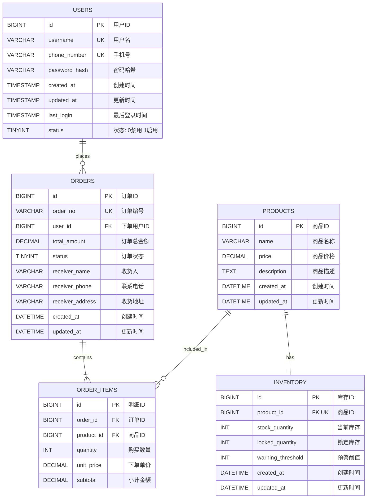

```mermaid
erDiagram
    USERS ||--o{ ORDERS : places
    ORDERS ||--|{ ORDER_ITEMS : contains
    PRODUCTS ||--|| INVENTORY : has
    PRODUCTS ||--o{ ORDER_ITEMS : included_in

    USERS {
        BIGINT id PK "用户ID"
        VARCHAR username UK "用户名"
        VARCHAR phone_number UK "手机号"
        VARCHAR password_hash "密码哈希"
        TIMESTAMP created_at "创建时间"
        TIMESTAMP updated_at "更新时间"
        TIMESTAMP last_login "最后登录时间"
        TINYINT status "状态: 0禁用 1启用"
    }

    ORDERS {
        BIGINT id PK "订单ID"
        VARCHAR order_no UK "订单编号"
        BIGINT user_id FK "下单用户ID"
        DECIMAL total_amount "订单总金额"
        TINYINT status "订单状态"
        VARCHAR receiver_name "收货人"
        VARCHAR receiver_phone "联系电话"
        VARCHAR receiver_address "收货地址"
        DATETIME created_at "创建时间"
        DATETIME updated_at "更新时间"
    }

    PRODUCTS {
        BIGINT id PK "商品ID"
        VARCHAR name "商品名称"
        DECIMAL price "商品价格"
        TEXT description "商品描述"
        DATETIME created_at "创建时间"
        DATETIME updated_at "更新时间"
    }

    INVENTORY {
        BIGINT id PK "库存ID"
        BIGINT product_id FK,UK "商品ID"
        INT stock_quantity "当前库存"
        INT locked_quantity "锁定库存"
        INT warning_threshold "预警阈值"
        DATETIME created_at "创建时间"
        DATETIME updated_at "更新时间"
    }

    ORDER_ITEMS {
        BIGINT id PK "明细ID"
        BIGINT order_id FK "订单ID"
        BIGINT product_id FK "商品ID"
        INT quantity "购买数量"
        DECIMAL unit_price "下单单价"
        DECIMAL subtotal "小计金额"
    }
```
