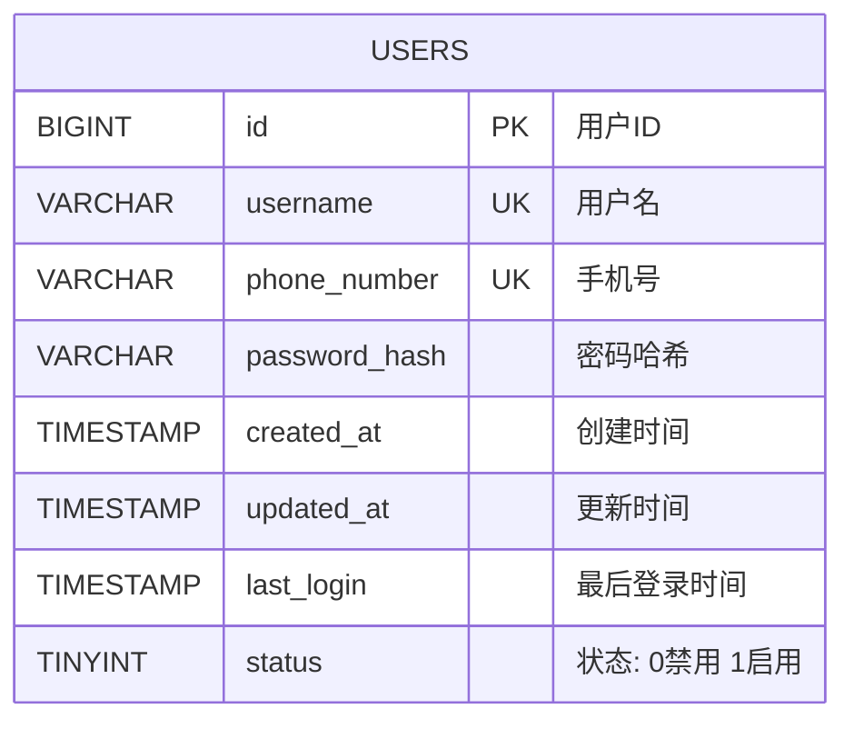

```mermaid
erDiagram
    USERS {
        BIGINT id PK "用户ID"
        VARCHAR username UK "用户名"
        VARCHAR phone_number UK "手机号"
        VARCHAR password_hash "密码哈希"
        TIMESTAMP created_at "创建时间"
        TIMESTAMP updated_at "更新时间"
        TIMESTAMP last_login "最后登录时间"
        TINYINT status "状态: 0禁用 1启用"
    }
```
