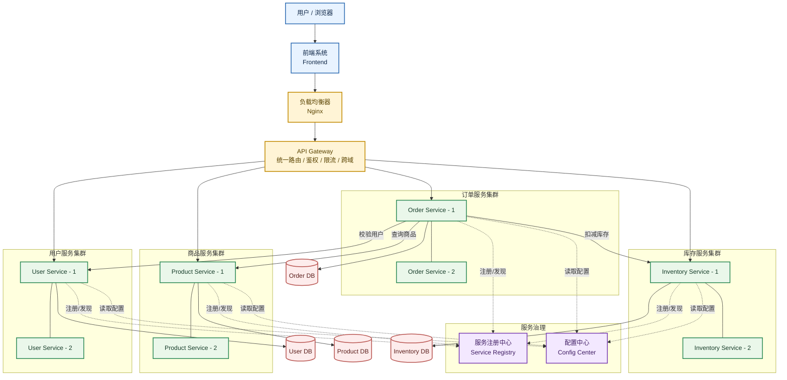

```mermaid
flowchart TB
    %% =========================
    %% Top Layer
    %% =========================
    U[用户 / 浏览器]
    FE[前端系统<br/>Frontend]
    LB[负载均衡器<br/>Nginx]
    GW[API Gateway<br/>统一路由 / 鉴权 / 限流 / 跨域]

    U --> FE --> LB --> GW

    %% =========================
    %% Middle Layer: Services
    %% =========================
    subgraph USER_CLUSTER[用户服务集群]
        direction TB
        U1[User Service - 1]
        U2[User Service - 2]
    end

    subgraph PRODUCT_CLUSTER[商品服务集群]
        direction TB
        P1[Product Service - 1]
        P2[Product Service - 2]
    end

    subgraph ORDER_CLUSTER[订单服务集群]
        direction TB
        O1[Order Service - 1]
        O2[Order Service - 2]
    end

    subgraph INVENTORY_CLUSTER[库存服务集群]
        direction TB
        I1[Inventory Service - 1]
        I2[Inventory Service - 2]
    end

    GW --> U1
    GW --> P1
    GW --> O1
    GW --> I1

    U1 --- U2
    P1 --- P2
    O1 --- O2
    I1 --- I2

    %% =========================
    %% Right Side: Governance
    %% =========================
    subgraph GOVERNANCE[服务治理]
        direction TB
        RC[服务注册中心<br/>Service Registry]
        CC[配置中心<br/>Config Center]
    end

    U1 -.注册/发现.-> RC
    P1 -.注册/发现.-> RC
    O1 -.注册/发现.-> RC
    I1 -.注册/发现.-> RC

    U1 -.读取配置.-> CC
    P1 -.读取配置.-> CC
    O1 -.读取配置.-> CC
    I1 -.读取配置.-> CC

    %% =========================
    %% Bottom Layer: Databases
    %% =========================
    UDB[(User DB)]
    PDB[(Product DB)]
    ODB[(Order DB)]
    IDB[(Inventory DB)]

    U1 --> UDB
    P1 --> PDB
    O1 --> ODB
    I1 --> IDB

    %% =========================
    %% Service Collaboration
    %% =========================
    O1 -->|校验用户| U1
    O1 -->|查询商品| P1
    O1 -->|扣减库存| I1

    %% =========================
    %% Styles
    %% =========================
    classDef client fill:#E8F3FF,stroke:#2F6DB3,stroke-width:2px,color:#0F2747;
    classDef gateway fill:#FFF4D6,stroke:#C28A00,stroke-width:2px,color:#5A4300;
    classDef govern fill:#F3E8FF,stroke:#7A3EB1,stroke-width:2px,color:#3F1D63;
    classDef service fill:#EAF7EA,stroke:#2E8B57,stroke-width:2px,color:#173D2A;
    classDef db fill:#FDECEC,stroke:#B85450,stroke-width:2px,color:#5C1F1C;

    class U,FE client;
    class LB,GW gateway;
    class RC,CC govern;
    class U1,U2,P1,P2,O1,O2,I1,I2 service;
    class UDB,PDB,ODB,IDB db;
```