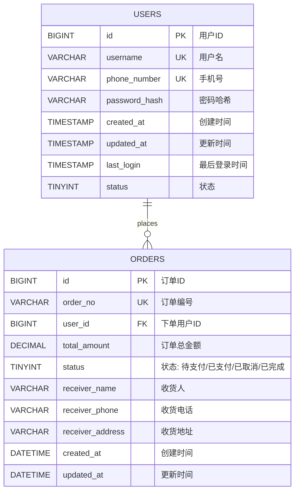

```mermaid
erDiagram
    USERS ||--o{ ORDERS : places

    USERS {
        BIGINT id PK "用户ID"
        VARCHAR username UK "用户名"
        VARCHAR phone_number UK "手机号"
        VARCHAR password_hash "密码哈希"
        TIMESTAMP created_at "创建时间"
        TIMESTAMP updated_at "更新时间"
        TIMESTAMP last_login "最后登录时间"
        TINYINT status "状态"
    }

    ORDERS {
        BIGINT id PK "订单ID"
        VARCHAR order_no UK "订单编号"
        BIGINT user_id FK "下单用户ID"
        DECIMAL total_amount "订单总金额"
        TINYINT status "状态: 待支付/已支付/已取消/已完成"
        VARCHAR receiver_name "收货人"
        VARCHAR receiver_phone "收货电话"
        VARCHAR receiver_address "收货地址"
        DATETIME created_at "创建时间"
        DATETIME updated_at "更新时间"
    }
```
